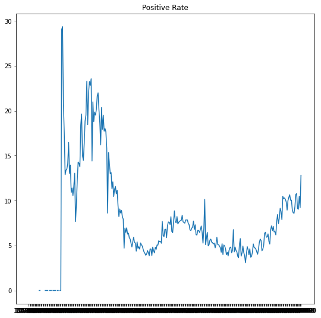

# Covid_Tracking_Python
## In this project I am importing the data, plotting basic metrics, and performing ultimate calculations in a first step towards determining how close local areas in the US are to herd immunity to Covid-19.
The files are the Python code, the raw data CSV from [Covid Tracking Project](https://covidtracking.com/data/charts), and the powerpoint summarizing current progress.

The plot below is the calculated Daily Positive Rate in the US as of 12/2/2020:

